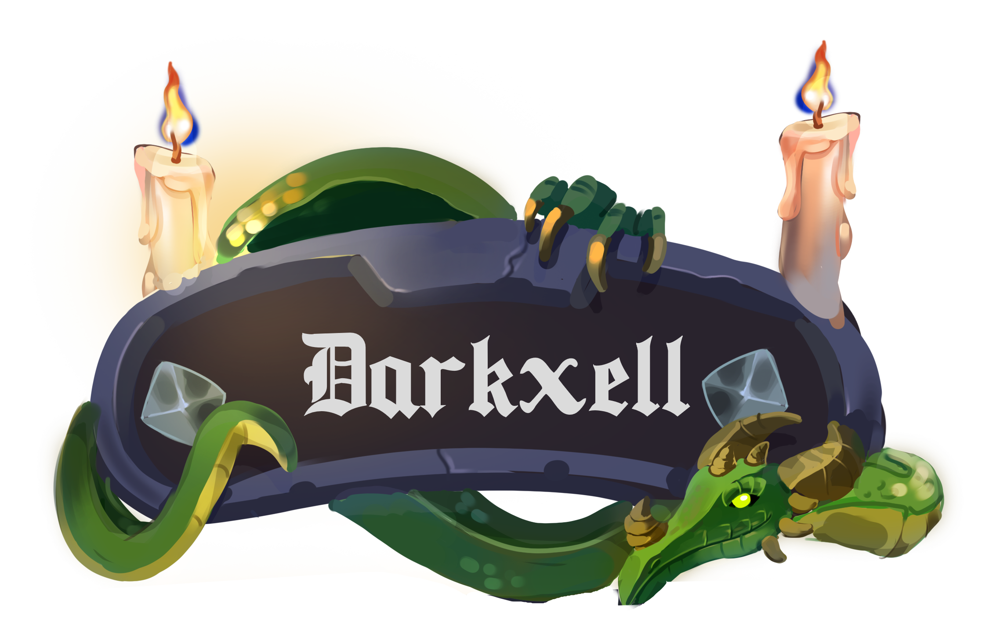

### Welcome to my github page!

  

This is the page of Nicolas Candela, French software dev.

You may find more info about real life me [in my CV](cv-color.pdf) or on [my portfolio](https://darkxell.github.io)!
Below is simply more info about the tech I specialize in.

|          | What I think I know, but I don't. |
|----------|------------------------------------------------------------------------------------------------------------------------------------------------------------------------------------------------------------------------------------------------------------------------------------------------|
| Java     | My main language. Used to both front and back, with a special interest to backend security. I have a few years of professional experience with it. Also happened to work a lot with awt at low level, that's fun. A bit burned out of web backends, I think JSPs are unspekable evil. |
| C#       | Csharp and Unity. I also mod Terraria. |
| Web      | Html, CSS, with a bit of both JS and Php.  Not my best asset, but I'm able to understand code and inject a few changes easily. Don't ask me to recode Facebook tho!                                                                                                                      |
| C++      | Working on it. Video games are pretty neat, right? Yeah. Welp, my Java knowledge isn't going to help all that much creating cool stuff, so I'm learning a more suited language.                                                                                                          |
| Ti-Basic | Yes, I started programing on my ti-82 calculator. Interestingly, coding for extremely limited single threaded hardware means you often have to find clever workarounds. Get's ya brain thinking, I'm telling ya!                                                                         |

